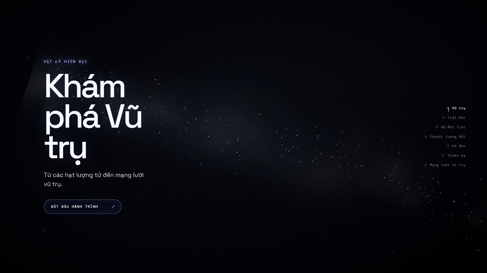

# Modern Physics Universe

**An interactive 3D journey from our home planet to the large-scale structure of the Universe.**



[Live Demo](https://modern-physics-universe.vercel.app) · [GitHub Repository](https://github.com/daudung185-ai/modern-physics-universe)

## Overview

Modern Physics Universe is a cinematic educational website that presents modern physics and astronomy through interactive WebGL scenes. The experience connects a close-up view of Earth with increasingly larger and more abstract scales: the Solar System, curved spacetime, a black hole, the Milky Way, and the cosmic web.

The interface and educational content are currently written in Vietnamese. Visual scale, color, motion, and time are intentionally stylized for clarity; the project is an educational visualization, not a precision scientific simulator.

## Features

- **Interactive Solar System** — Explore the Sun and eight planets with artistic orbital spacing, axial rotation, orbit paths, world-space trails, Saturn's rings, and selectable fact panels.
- **Earth & Moon** — A shared Earth model supports both the cinematic close-up and Solar System views, with procedural surface detail, moving clouds, an atmospheric rim, directional lighting, and an orbiting Moon.
- **Relativity & spacetime** — A deformable three-dimensional spacetime lattice visualizes mass-induced curvature, geodesics, bent light paths, gravitational time dilation, the Einstein field equation, and the 1905–1915 history of relativity.
- **Black hole** — A shader-driven, layered accretion disk surrounds an event horizon and photon ring, accompanied by interactive explanations, equations, and a time-dilation comparison.
- **Milky Way galaxy** — A generated point-cloud galaxy combines spiral arms, a central bulge, dust, gas, a dark-matter visualization, orbital markers, and the Solar System's approximate galactic context.
- **Cosmic web** — A finite artistic volume of clusters, filaments, and voids includes interactive formation and expansion demonstrations plus focused educational sections.
- **Cinematic 3D navigation** — GSAP-controlled camera transitions connect every scene, while constrained orbit controls, responsive overlays, and a persistent star field keep the experience coherent across desktop and mobile.

## Tech Stack

- React 19
- Vite 7 with `@vitejs/plugin-react`
- Three.js
- `@react-three/fiber`
- `@react-three/drei`
- GSAP
- CSS

## Project Structure

```text
modern-physics-universe/
├── public/
│   └── textures/planets/   # Optional real planet textures
├── src/
│   ├── components/         # 3D scenes, objects, camera, and shared UI
│   ├── sections/           # Scene-specific educational overlays
│   ├── data/               # Planet and science-content data
│   ├── utils/              # Geometry, motion, texture, and layout helpers
│   ├── App.jsx             # Scene state and experience orchestration
│   ├── main.jsx            # React entry point
│   └── styles.css          # Global responsive visual system
├── tests/                  # Geometry and cosmic-web data tests
├── index.html
└── vite.config.js
```

## Getting Started

### Prerequisites

- Node.js `20.19+` or `22.12+`
- npm
- A modern browser with WebGL support

### Install and run locally

```bash
git clone https://github.com/daudung185-ai/modern-physics-universe.git
cd modern-physics-universe
npm install
npm run dev
```

Open the local URL printed by Vite, typically `http://localhost:5173`.

### Production build

```bash
npm run build
npm run preview
```

The optimized production files are generated in `dist/`.

### Optional planet textures

The application works without external image assets by using generated fallback textures. To use real planet maps, add the expected 1K–2K files described in [`public/textures/planets/README.md`](public/textures/planets/README.md), set the following environment variable, and restart Vite:

```env
VITE_USE_PLANET_TEXTURES=true
```

## Deployment with Vercel

Import the GitHub repository into Vercel and select the Vite framework preset. Use `npm run build` as the build command and `dist` as the output directory. Once connected, pushes to the production branch can be deployed automatically, while other branches can receive preview deployments. See the [official Vercel documentation for Vite](https://vercel.com/docs/frameworks/frontend/vite) for current deployment details.

## Performance & Technical Notes

- Dense visual systems use buffer geometry, typed arrays, memoized resources, and reusable materials rather than large collections of individual meshes.
- Mobile layouts reduce star counts, geometry detail, and cosmic-web point density; the canvas pixel ratio is capped for steadier rendering.
- A central scene state and camera rig coordinate transitions and prevent orbit controls from conflicting with cinematic motion.
- Procedural textures provide a reliable fallback, so missing optional planet images do not cause a blank scene.
- The project avoids heavyweight post-processing and uses lightweight shader and additive-material effects where appropriate.

The existing cosmic-web geometry checks can be run with:

```bash
node tests/cosmicWeb.test.mjs
```

## Future Improvements

- Add a curated set of licensed, optimized planetary texture maps.
- Introduce an English/Vietnamese language switch.
- Expand automated interaction and visual-regression coverage.
- Continue profiling GPU and memory usage on a wider range of mobile devices.

## Author & Context

Created by [daudung185-ai](https://github.com/daudung185-ai) as an educational 3D web project exploring scientific storytelling, realtime graphics, and cinematic frontend interaction.
